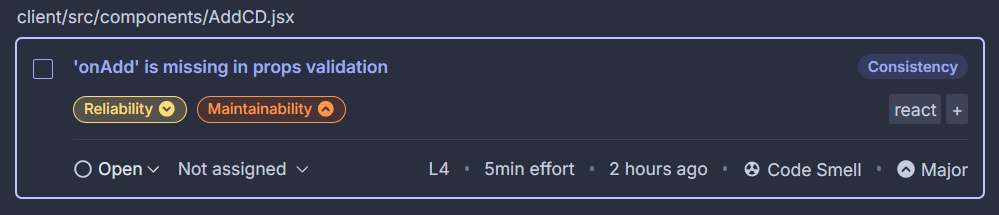

# Test Sonar Cube

On va analyser le projet: pour commencer on va screen ce Sonar Cloud a analysé:


## Fiabilité (Reliability) :

- Cela concerne la capacité d'un système ou d'une application à fonctionner sans erreur sur une période donnée.

- Les indicateurs clés incluent la gestion des erreurs, les taux de panne et la continuité des services.

- Dans notre contexte, les zones identifiées comme critiques en termes de fiabilité sont des points nécessitant des tests approfondis et une surveillance active.

## Maintenabilité (Maintainability) :

- Cela mesure la facilité avec laquelle le code ou le système peut être mis à jour, corrigé ou amélioré.

- Les hotspots dans ce domaine indiquent des parties du code qui sont complexes, mal documentées ou difficiles à comprendre.

- Il est essentiel de simplifier ces zones ou d'améliorer leur documentation pour limiter les obstacles futurs.

## Points sensibles en matière de sécurité (Security Hotspots) :

- Ce sont des éléments du système susceptibles de contenir des vulnérabilités ou des failles.

- Ils incluent, par exemple, des accès non sécurisés, des données non chiffrées ou des configurations faibles.

- La priorité est ici d'effectuer des analyses approfondies, de corriger les vulnérabilités et d'ajouter des contrôles de sécurité.

# Analyse des Erreurs



L'erreur " ```onAdd``` is missing in props validation" signifie que la propriété onAdd, utilisée dans un composant React, n'a pas été correctement validée à l'aide des propTypes. Voici une explication simplifiée pour clarifier cette situation :

- Les propTypes et leur rôle :
  - Les propTypes servent à spécifier les types de propriétés (props) qu'un composant peut recevoir. Ils permettent de vérifier que chaque propriété répond aux exigences définies.

- Pourquoi cette erreur apparaît-elle ?

  - Lorsqu’un composant utilise une propriété comme onAdd, mais qu'elle n'est pas explicitement déclarée dans l'objet propTypes

- Exemple de code avec le problème :

```js
const AddCD = ({ onAdd }) => {
  ...

  return (
    <div className="container">
      ...
    </div>
  );
};

export default AddCD;
```

  Ici, la propriété onAdd est utilisée, mais aucune validation n’a été définie pour elle.

- Solution au problème : Nous devons ajouter une validation dans l'objet propTypes pour indiquer que onAdd est une fonction. Voici le code corrigé :

```js
AddCD.propTypes = {
  onAdd: PropTypes.func.isRequired,
};
```

